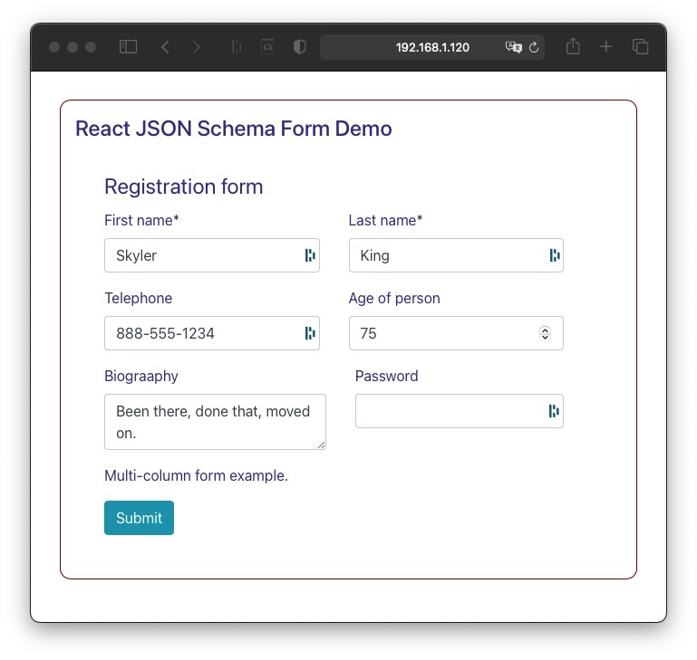

# Example of React JSON Schema Form with Styled Components

## Description
This web application displays a styled from based on a JSON
document, a JSON schema describing the document, and a JSON
UI schema that says how to render the form items of the document.

It uses a custom object field template in its Ui schema to force
fields into two columns or one column for narrow views.

## Install

1. Clone this project
1. `yarn install`

## Run

1. `yarn start`
1. Browser address: http://localhost:3000

## Screen

---

This project was bootstrapped with [Create React App](https://github.com/facebook/create-react-app).

## Available Scripts

In the project directory, you can run:

### `yarn start`

Runs the app in the development mode.\
Open [http://localhost:3000](http://localhost:3000) to view it in the browser.

The page will reload if you make edits.\
You will also see any lint errors in the console.

### `yarn test`

Launches the test runner in the interactive watch mode.\
See the section about [running tests](https://facebook.github.io/create-react-app/docs/running-tests) for more information.

### `yarn test:coverage`

Like `yarn test` but outputs a coverage table.\
See the section about [running tests](https://facebook.github.io/create-react-app/docs/running-tests) for more information.

### `yarn build`

Builds the app for production to the `build` folder.\
It correctly bundles React in production mode and optimizes the build for the best performance.

The build is "minified", and the filenames include the hashes.\
Your app is ready to be deployed!

See the section about [deployment](https://facebook.github.io/create-react-app/docs/deployment) for more information.
